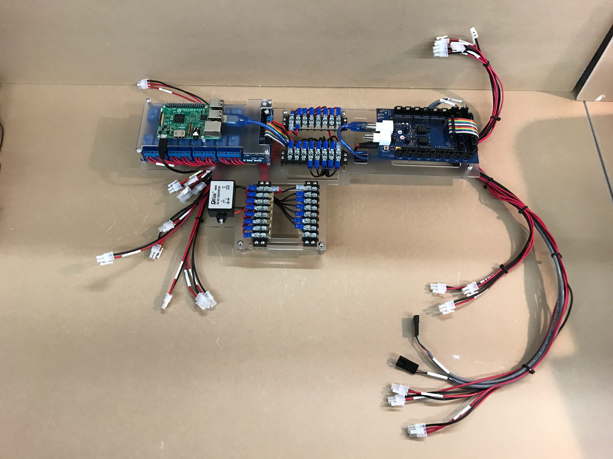
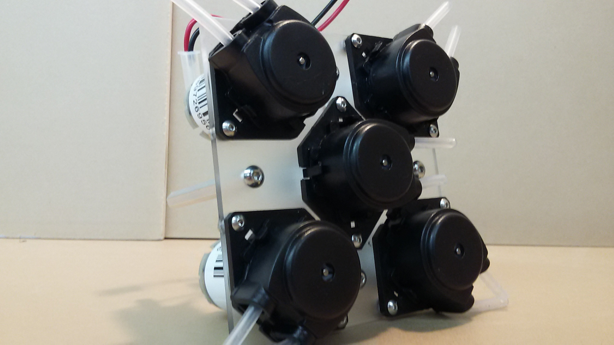

# Build  a Personal Food Computer v2.0 (PFC2)

## Overview of the PFC

* **Audience**: users
* **Skill Level**: beginner

[Prev: Start](guides:food_computer_2:start)

1. **Overview of the PFC**
1. [Ordering the parts](guides:food_computer_2:2_order)
1. [Building the PFC](guides:food_computer_2:3_build)
1. [Installing the software (openag_brain)](guides:food_computer_2:4_software)
1. [Growing plants](guides:food_computer_2:5_grow)
1. [(optional) Contributing to OpenAg](/contribute)

---

The OpenAg™ Personal Food Computer v2.0 is the next generation [Personal Food Computer](https://www.media.mit.edu/projects/personal-food-computer/overview/). It was preceded by the [Personal Food Computer 1.0](:food_computer_1).

## Technical Overview of PFC2 Hardware

The PFC2 is a climate control device designed towards precision, controlled environment agriculture.

The food computer is composed of 6(7 with frame) main components:

- Frame/Fluids Shelf
- Air Heating/Cooling
- Water Manifold
- Pump Manifold
- Brain Module
- Power Module

#### Frame

The frame is what keeps all the other modules together, and is what will usually get built first. It is composed of 3 sections, the growth chamber, electronics panel, and the fluids shelf. The growth chamber houses the basin in which the plants grow.

#### Power Module

The power module supplies power to all the other electrical components. It houses the power switch, AC/DC converters, and a safe shutdown relay timer board for the Raspberry Pi.

#### Brain Module

The brain module is the most complex, and arguably the most important part of the PFC2. It orchestrates the entire system by reading sensor inputs and sends commands to the actuator.

The brain module's main subcomponents are the Relay Board, Raspberry Pi, Arduino, and Signal Board. These all get wired together and get connected to the various sensors and actuators on the PFC2.

#### Air Heating/Cooling

The air heating and cooling loop is one of the strengths of the PFC2. It uses an open source chiller which happens to be one of the smallest compressor based chillers in the world called [KippKitts](https://www.kippkitts.com/).

#### Water Manifold

The water manifold goes into the basin and houses water sensors and some circulation pumps. It is also where the peristaltic pump will pump the nutrients into.

#### Pump Manifold

The pump manifold holds 5 pumps which will pump nutrients and pH adjustment fluids into the basin.

## Process Overview

|    |    |
| :- | :- |
| Total Cost | [ Roughly $2914](http://forum.openag.media.mit.edu/t/pfc-2-0-beta-materials-cost-2914/1299)|
| Total Time | Roughly 30 Hours |

Building the PFC is basically:

1. building the 6 modules mentioned above,
2. putting it all together.

In the next step, we'll go over all the parts you need to buy in order to get started.

[Next: 1. Overview of the PFC](guides:food_computer_2:2_order)
