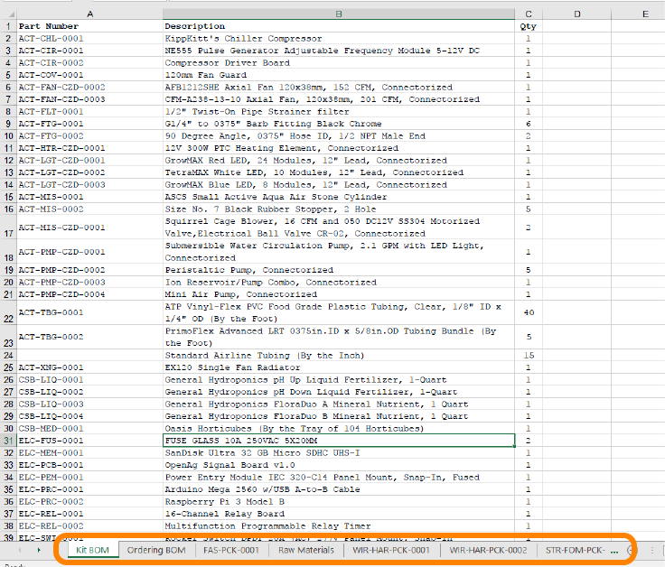

# Build a Personal Food Computer 2.0 (PFC2)

## Ordering the Parts

- **Audience**:  users
- **Skill Level**: beginner

[Prev: 1. Overview of the PFC](guides:food_computer_2:1_overview)

1. [Overview of the PFC](guides:food_computer_2:1_overview)
1. **Ordering the parts**
1. [Building the PFC](guides:food_computer_2:3_build)
1. [Installing the software (openag_brain)](guides:food_computer_2:4_software)
1. [Growing plants](guides:food_computer_2:5_grow)
1. [(optional) Contributing to OpenAg](/contribute)

---

Go to [https://github.com/OpenAgInitiative/openag_pfc2](https://github.com/OpenAgInitiative/openag_pfc2) and open `openag_pfc2/BOM/BOM_MASTER.xlsx`

Check the `Kit BOM` sheet. There should be a list of all the components. Some of the other sheets are breakdowns of those components. For example, `FAS-PCK-0001` is one item on `Kit BOM` but it is actually a package of fasteners. There are links to things to buy under the `Ordering BOM` sheet.

When you buy items for `FAS-PCK-0001`, it helps to have all your materials in one place, especially the fasteners in small bags labelled according to the "Line #" in the BOM.

Once you have all the components ready, we're ready to dive into making a PFC2.

[Next: 3. Building the PFC](guides:food_computer_2:3_build)
