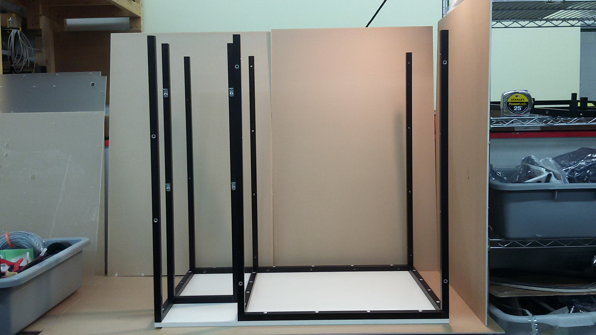
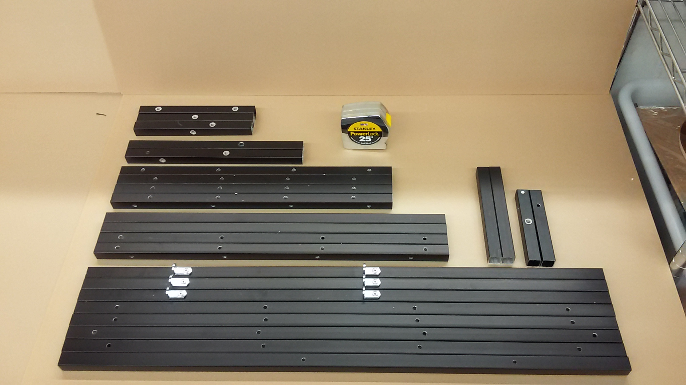

# Build a Personal Food Computer 2.0 (PFC2)

## Building the PFC

- **Audience**:  users
- **Skill Level**: beginner

[Prev: 3. Building the PFC](guides:food_computer_2:3_build)

1. [Overview of the PFC](guides:food_computer_2:1_overview)
1. [Ordering the parts](guides:food_computer_2:2_order)
1. [Building the PFC](guides:food_computer_2:3_build)
  1. ~~Cut panels, frame, connectorize wires~~
  1. **Frame**
  1. [Brain Module](guides:food_computer_2:3.3_brain)
  1. [Power Module](guides:food_computer_2:3.4_power)
  1. [Air Heating/Cooling](guides:food_computer_2:3.5_hvac)
  1. [Water Manifold & Pump Manifold](guides:food_computer_2:3.6_pump)
1. [Installing the software (openag_brain)](guides:food_computer_2:4_software)
1. [Growing plants](guides:food_computer_2:5_grow)
1. [(optional) Contributing to OpenAg](/contribute)

---
# Building the Frame

## Tools

- 1/4" Flathead screw driver
- Rubber Mallet

## Parts

|Quantity| Part # | Description |
| :---: | :---: | :--- |
| 4 | STR-BAR-0001 | 18" Horizontal bar Depthwise in grow chamber |
| 2 | STR-BAR-0002 | 29.87" vertical bar in back of grow chamber|
| 2 | STR-BAR-0003 | 21.25" horizontal bar widthwise in rear of grow|
| 2 | STR-BAR-0004 | 8.25" horizontal bar widthwise in Electrical Box|
| 2 | STR-BAR-0005 | 12" horizontal bar Depthwise in Electrical Box|
| 2 | STR-BAR-0006 | 5.25" horizontal bar depthwise in Water cabinet|
| 2 | STR-BAR-0007 | 7" horizontal bar widthwise in rear of Water Cabinet|
| 2 | STR-BAR-0008 | 21.25" horizontal bar widthwise in front of grow chamber|
| 2 | STR-BAR-0009 | 29.87" vertical bar in front of grow chamber|
| 3 | STR-BAR-0010 | 29.87" vertical bar in Electrical Box and Water Cabinet with L Brackets|
| 1 | STR-BAR-0011 | 29.87" vertical bar in Electrical Box and Water Cabinet **without** L Brackets |
| 1 | STR-BAR-0012 | 8.25" horizontal bar widthwise in upper rear of Electrical Box (2 threaded holes instead of 1)|
| 1 | STR-PNL-0001 | Wooden Baseplate |
| 18 | S-018-32-075-PST-F-AL | Binding Posts (Screw and thread) |

## Steps

- Make the bottom
- Base Plate
- Add vertical
- leave the top

[Next: 3.3. Build the Brain Module](guides:food_computer_2:3.3_brain)
